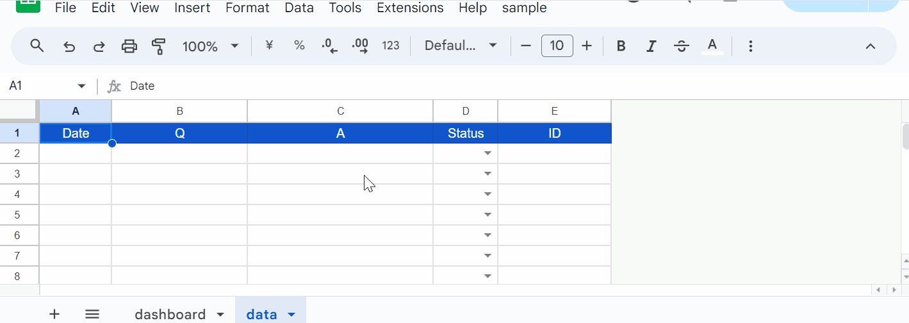
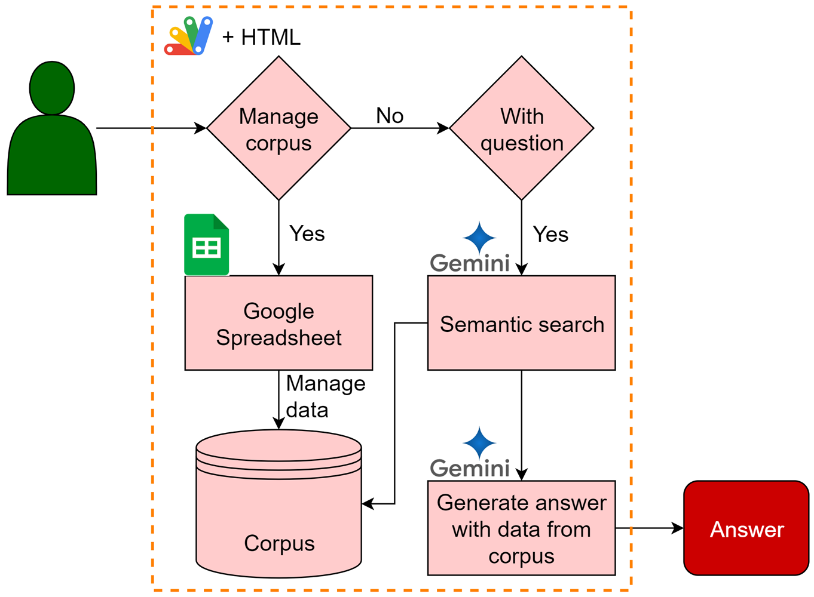
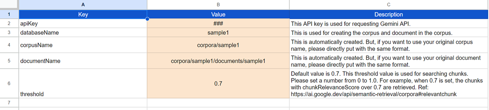
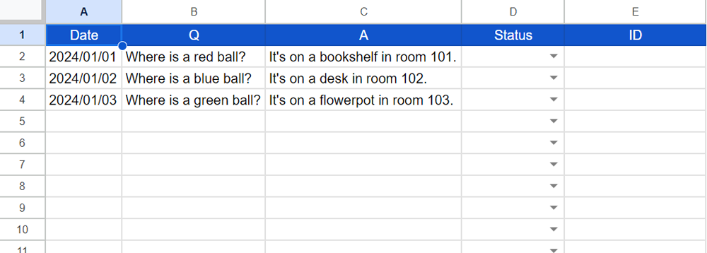
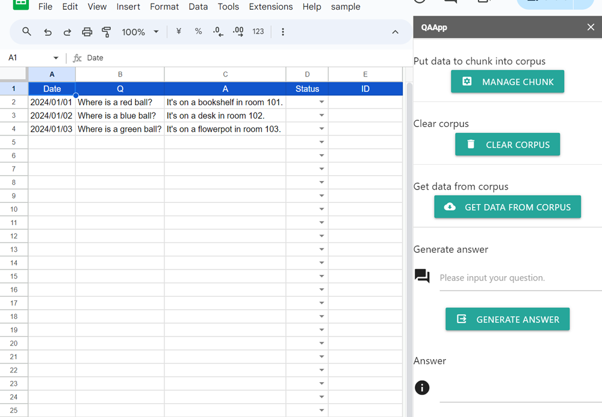

# QAApp

## Improving Gemini's Text Generation Accuracy with Corpus Managed by Google Spreadsheet as RAG

# Overview

Gemini's RAG works well for large datasets, but smaller ones require prompting or data upload. This report explores using Gemini 1.5 Flash/Pro with RAG on medium-sized Google Spreadsheets.

# Description

The document discusses Gemini's text generation abilities and efficient approaches for various data sizes. Retrieval-Augmented Generation (RAG) is recommended for large datasets, while smaller datasets benefit from including data directly in prompts or files. [Ref](https://medium.com/google-cloud/harnessing-geminis-power-a-guide-to-generating-content-from-structured-data-45080dac0bbb)

A specific scenario is presented where content generation is required using Gemini 1.5 Flash and RAG for a Q&A dataset of around 100,000 entries. The possibility of using a Google Spreadsheet to manage the corpus data is explored due to its scalability.

While Gemini offers semantic retrieval through 'models.generateAnswer', it relies on the 'models/aqa' model which might have limitations in response diversity and update frequency compared to the more versatile Gemini 1.5 Flash and Pro models.

This report proposes strategies to address these limitations and achieve high-quality content generation using Gemini 1.5 Flash/Pro models with RAG and Google Spreadsheets for medium-sized datasets.

This approach aims to improve the overall accuracy and effectiveness of Gemini's text generation for such scenarios.

# Workflow

## Process for managing corpus

1. Data: Read data from Google Spreadsheet.
2. Divide data into chunks: Break down the data into smaller segments (chunks) and store them in a document within the corpus. In this case, each chunk is created every row.

## Process for generating an answer

1. Retrieve relevant chunks: Use the "corpora.documents.query" method to retrieve chunks that meet the specified threshold criteria.
2. Upload chunks to Gemini: Upload the selected chunks to Gemini as a file.
3. Generate content: Employ the Gemini 1.5 Flash and Gemini 1.5 Pro models to generate content based on the prompt and the uploaded file.

# For application

In this report, to implement the aforementioned goal in a practical application, I utilized a Google Spreadsheet and Google Apps Script.

# Usage

## 1. Copy a Google Spreadsheet

When you test this application, you can do it by copying the following Google Spreadsheet. After you copy the Spreadsheet into your Google Drive, you can do the following steps.

You can copy the Spreadsheet to your Google Drive by accessing the following URL.

[https://docs.google.com/spreadsheets/d/1zhq82EbhJXBYyYM9t97ixwxiXCc5wDk8Ytl1mUrXUEs/copy](https://docs.google.com/spreadsheets/d/1zhq82EbhJXBYyYM9t97ixwxiXCc5wDk8Ytl1mUrXUEs/copy)

When you open this Spreadsheet, you can see the following 2 sheets.

- `dashboard`: This sheet is used for setting variables including the API key for using Gemini API and corpus name.
- `data`: This sheet is used for managing chunks in the corpus.

This spreadsheet has a container-bound script including 5 script files, 1 HTML file, and 1 JSON file.

- `appsscript.json`: Manifest file.
- `Code.gs`: Main functions.
- `CorporaApp.gs`: [https://github.com/tanaikech/CorporaApp](https://github.com/tanaikech/CorporaApp)
- `GeminiWithFiles.gs`: [https://github.com/tanaikech/GeminiWithFiles](https://github.com/tanaikech/GeminiWithFiles)
- `QAApp.gs`: Main class object. [https://github.com/tanaikech/QAApp](https://github.com/tanaikech/QAApp)
- `javascript.gs`: Javascript for HTML.
- `index.html`: HTML for user interface.

## 2. Linking Google Cloud Platform Project to Google Apps Script Project

In this case, you can see how to do this at [my repository](https://github.com/tanaikech/Linking-Google-Cloud-Platform-Project-to-Google-Apps-Script-Project-for-New-IDE). Please link your Google Cloud Platform Project with the container-bound script of the copied Spreadsheet.

Also, please enable 2 APIs **Generative Language API** and **Sheets API** at the API console.

## 3. Set "dashboard" sheet

The above image is the "dashboard" sheet. Please set the column "Value" in the dashboard sheet to your situation. At least, please set your API key for using Gemini API. The API is used for uploading a file to Gemini and generating content. The corpus is managed by the access token. So, it is required to link the Google Cloud Platform Project to the Google Apps Script Project.

## 4. Set "data" sheet

The above image is the "data" sheet. Please set the questions and answers to columns "B" and "C". Column "D" is used for managing data. Column "E" shows IDs when the data is put into the corpus. Now, these are not required to be used.

After the above setting, this application can be worked.

## 5. Testing

When you run "Open sidebar" from the custom menu, the sidebar is opened as shown in the above image. The demonstration can be seen at the top of this report.

1. Open sidebar.
2. Put the data into columns "A" to "C". It supposes that you have already done this.
3. Click "MANAGE CHUNK" on the sidebar. By this, the data of columns "A" to "C" are put into corpus. And, each ID on the corpus is automatically put into column "E".
4. Put your question into the text box of "Generate answer".
5. Click "GENERATE ANSWER". By this, the answer is generated by Gemini with your data.

If you want to update data, please do the following steps.

1. Modify columns "B" and "C" and set column "D" to "Update".
2. Click "MANAGE CHUNK" on the sidebar.

If you want to delete several pieces of data, please do the following steps.

1. Set column "D" to "Delete".
2. Click "MANAGE CHUNK" on the sidebar.

If you want to clear all data in the corpus, please do the following steps.

1. Click "CLEAR CORPUS" on the sidebar.

If you want to load data from the existing corpus, please do the following steps.

1. Set "databaseName", "corpusName", and "documentName" in the "dashboard" sheet. Here, please set the name of the existing corpus and document.
2. Click "GET DATA FROM CORPUS". By this, the data is loaded from your corpus and put into the "data" sheet. In this case, the data is overwritten in the sheet. Please be careful about this.

# Summary

This report details a method to improve Gemini's text generation accuracy with medium-sized datasets using Google Spreadsheet as a Retrieval-Augmented Generation (RAG) corpus. Instead of relying solely on the 'models/aqa' model, this approach leverages Gemini 1.5 Flash/Pro models for increased response diversity and update frequency. Data from the spreadsheet is divided into chunks and stored within a Google Cloud Platform corpus. A Google Apps Script facilitates data management and content generation. This allows for dynamic, accurate responses to user queries based on the information stored in the spreadsheet.

---

# Licence

[MIT](LICENCE)

# Author

[Tanaike](https://tanaikech.github.io/about/)

[Donate](https://tanaikech.github.io/donate/)

# Update History

- v1.0.0 (October 9, 2024)

  1. Initial release.

[TOP](#top)
